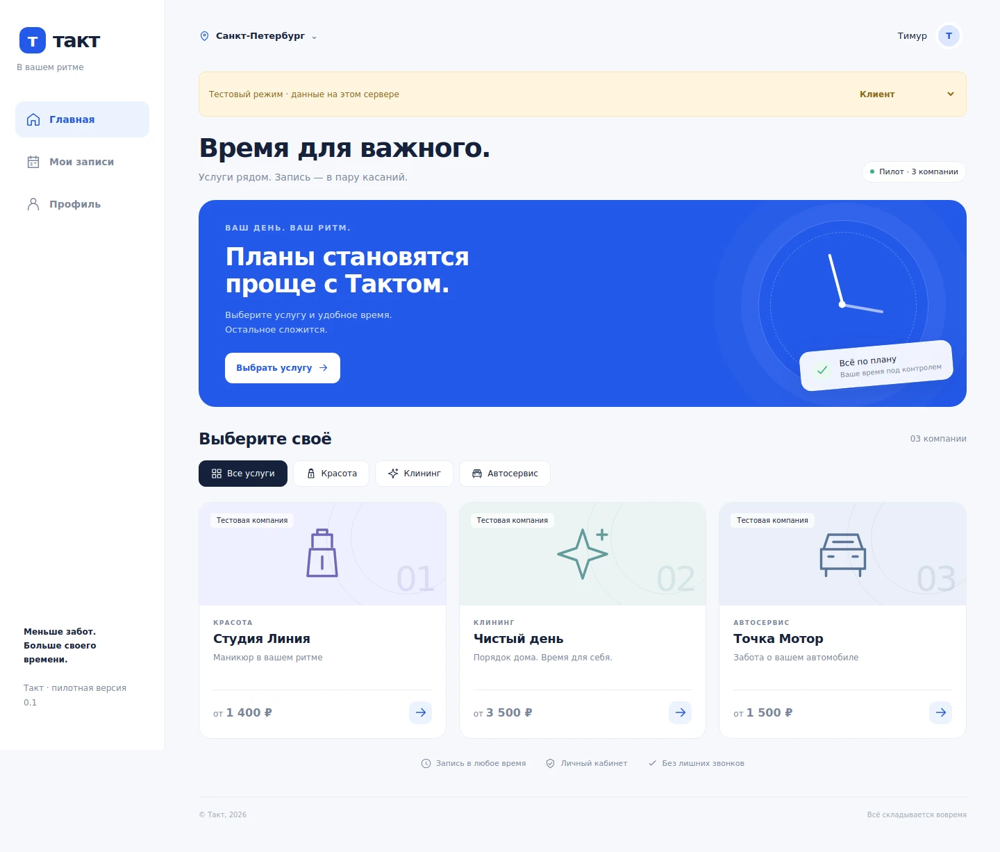

# Такт · Telegram Mini App

Белая основа, синий акцент `#2459E8`. Mini App для клиентов, компаний и владельца. Бот: [@takt_service_bot](https://t.me/takt_service_bot).

## Версия 0.2

- Старые три демонстрационные компании и записи сохранены; доступны по своим ссылкам. Новые кабинеты создаются без миграции базы.
- Мастер: регистрация → контакты → первая услуга и часы → личная ссылка для клиентов. Один новый кабинет на Telegram-аккаунт.
- Клиент: ссылка мастера → услуга → дата/время → контакты → заявка. Общего каталога нет.
- Журнал по дням, добавление услуг, настройки и отправка ссылки. Пока один общий ресурс на кабинет, одинаковые часы каждый день, московское время. Оплаты и подписки не реализованы.
- Клиент: свои записи, история, отмена будущей записи.
- Компания: заявки, подтверждение, отмена, завершение, цены, длительность услуг и ежедневные часы работы.
- Владелец: переключение компаний и назначение администраторов по Telegram ID.
- Серверная проверка Telegram initData (срок входа 1 час), разграничение доступа по компаниям.
- Серверная цена, SQL-триггер против пересечения активных заявок, защита от повторной отправки.
- Статусы и уведомления сохраняются одной транзакцией. Очередь отправляет статусы и напоминания за 24 часа каждые 5 минут.
- Прямая ссылка: `https://t.me/takt_service_bot?startapp=c_nail` (также `c_clean`, `c_auto`), после настройки Main Mini App.

## Локальная проверка

Node.js 22.13+ (проверено на 24). Внешние зависимости для локального сервера не нужны:

```sh
npm run dev
npm test
npm run check
```

Открыть http://127.0.0.1:8787. Панель сверху переключает тестовые роли. Данные сохраняются в `.local/takt.sqlite`. Администратор `9002` имеет доступ только к маникюру. Демовход действует **только при DEV_MODE=true и хосте localhost/127.0.0.1**. В Cloudflare этой переменной нет; не добавлять её в production.

Тесты: подпись, срок входа, tenant isolation, цены, пересечения, повторная отправка, отмена, статусы, даты и детали клининга. SQLite — локальный адаптер D1; smoke-test на реальном Cloudflare обязателен.

## Cloudflare: первичная настройка

1. Подключить `teymurlan1/Takt` к Cloudflare Workers Builds, ветка `main`.
2. Создать D1 database `takt-db`. Вставить её UUID в `wrangler.jsonc` → `database_id` вместо заглушки.
3. Применить `migrations/0001_initial.sql` через консоль D1 либо CLI.
4. Указать числовой Telegram ID владельца в `SUPERADMIN_IDS` (несколько — через запятую).
5. Добавить `BOT_TOKEN` как **Secret** в Cloudflare. Не коммитить и не включать в клиентский код.
6. Deploy command: `npx wrangler deploy`. Фронтенд без сборки, каталог `public/` обслуживается Worker Assets.
7. Проверить `/api/health` и открыть приложение в Telegram.

CLI-вариант:

```sh
npm ci
npx wrangler login
npx wrangler d1 create takt-db
# Вставить database_id и SUPERADMIN_IDS в wrangler.jsonc
npm run db:remote
npx wrangler secret put BOT_TOKEN
npm run deploy
```

UUID и токен не предзаполнены. `APP_URL` зарезервирован и сейчас необязателен. Cron указан в конфигурации. Если SUPERADMIN_IDS меняется через панель Cloudflare, обновить и wrangler.jsonc перед следующим deploy.

## Telegram

В @BotFather выбрать @takt_service_bot:

- Bot Settings → Configure Mini App → Main Mini App: HTTPS-адрес Worker.
- Menu Button: «Открыть Такт» и тот же адрес.
- Клиентам и сотрудникам в профиле приложения нажать «Разрешить уведомления».
- Telegram ID виден в профиле. Владелец добавляет сотрудника по ID в кабинете.

Чатовый диалог и webhook для этой версии не нужны. Из обычного браузера доступен каталог, запись требует Telegram-входа. После deploy проверить двумя аккаунтами: заявка → подтверждение → уведомление → отмена → освобождение времени. Проверить все прямые ссылки и cron.

## Границы пилота

- Одно расписание на компанию, один заказ одновременно, ежедневно. Мастера, бригады, посты и исключения пока отсутствуют.
- МСК; горизонт 30 дней, шаг 30 минут, длительность услуги 30–480 минут.
- До 10 будущих активных записей на клиента. Выдача последних 500 записей; пагинация позже.
- Клиент отменяет любую будущую запись. Правило 24 часов пока не вводили.
- Подтверждённая запись, созданная менее чем за сутки, получит напоминание в ближайшем цикле cron.
- Telegram: до 5 попыток, доставка at-least-once. Редкий дубль возможен, если сообщение принято, но ответ потерян. Блокировка бота препятствует доставке; запись в базе сохраняется.
- Создание новых компаний, удаление сотрудников, платежи, подписки, переносы и расширенная аналитика — следующий этап.
- До реальных клиентов заменить демо-данные, добавить реквизиты оператора и политику обработки данных, настроить резервирование и мониторинг. Текущее согласие — для теста с вымышленными данными.

## Структура

`public/` — интерфейс без сборки. `src/` — API и Telegram auth. `migrations/` — D1. `scripts/` — локальный сервер SQLite. `test/` — критичные сценарии.

## Интерфейс



Проверены мобильный экран 390 px и полный сценарий: создание → подтверждение компанией → отмена клиентом. Проверка Worker `wrangler deploy --dry-run` выполнена, **реальный deploy ещё не выполнен**.
